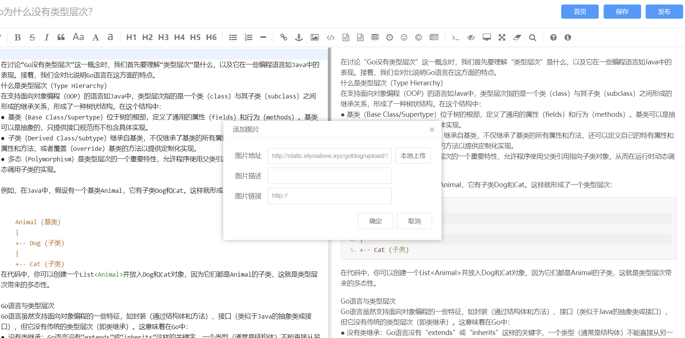

# 简易Go语言博客项目

参考了B站一个[up](https://b23.tv/7hXiHkL)的视频做出来的（~~应该也是哪个开源项目~~），原项目很糙，简介展示有致命Bug和很多小功能没有去实现。web框架搭建上也比较混乱，当然刚学完Go拿这个练练手绝对ok的


### 1. 项目展示

#### 1.1 首页


#### 1.2 登陆页面


#### 1.3 搜索功能


#### 1.4 写作页面


#### 1.5 支持图片上传

后台设置好服务器路径，本地上传图片到服务器会回显在md图片地址栏




#### 1.6 支持自定义类别展示


#### 1.7 文章详情页面展示


#### 1.8 整合文章评论区


## 2. 原开源项目的Bug修正和项目补全

#### 2. 1 简介展示Bug

原代码关于简介是这样处理的

```go
// ... 这里的context就是数据库存储的md5转存为Html格式的数据，本质还是带html格式的文本
content := []rune(post.Content)
if len(content) > 100 {
    content = content[0:100]
}
```

​	如果context是html格式的文本，我们直接粗暴的截取`context = context[:100]`会导致获取到的html代码不完整，像标签不能闭合、与内容有关的数据少之又少等等问题，导致我们最后渲染到页面上乱码或者显示出错。


我们的改进方案是将我们的简介“脱HTML化”，把所有html的标签和换行去掉，再来取前100个字符，另外为了方便和准确地解析中文字符，要用上`[]rune`（**关于rune的理解见文末**）

```go
content := utils.TrimHtml(post.Content)

if len(content) >= 100 {
    content = string([]rune(utils.TrimHtml(post.Content))[:100])
}
```


#### 2.2 基于Redis的计数器和IP访问次数限制器

原项目的“观看次数”没有做，这边我打算使用Redis来实现我们的计数器，另外顺手也试试为这个项目加入一个防止用户恶意刷次数的IP访问次数限制。

##### 2.2.1 为啥用Redis？

因为Redis6.0引入**多线程I/O**，只是用来**处理网络数据的读写和协议的解析**，而**执行命令依旧是单线程**，从实现机制可以看出，Redis 的多线程部分只是用来处理网络数据的读写和协议解析，执行命令仍然是单线程顺序执行。所以我们不需要去考虑控制 Key、Lua、事务，LPUSH/LPOP 等等的并发及线程安全问题。单个 Redis 命令的执行是原子性的。


##### 2.2.2 关键代码

先要使用Redis，你需要将自己的Redis的ip和port，以及密码和选定的数据库编号填入`config.toml`


具体实现在`utils`中

```go
package utils

import (
	"fmt"
	"github.com/go-redis/redis"
	"go-blog/config"
	"strconv"
)

func NewClient() *redis.Client {
	client := redis.NewClient(&redis.Options{
		Addr:     config.Cfg.Redis.Addr,
		Password: config.Cfg.Redis.Password,
		DB:       config.Cfg.Redis.DataBase,
	})

	// 通过 client.Ping() 来检查是否成功连接到了 redis 服务器
	_, err := client.Ping().Result()
	if err != nil {
		panic(err)
	}
	return client
}

func AddViews(client *redis.Client, articleId int) {
	id := strconv.Itoa(articleId)
	_, err := client.Incr(id).Result()
	if err != nil {
		panic(err)
	}
}

func GetViews(client *redis.Client, articleId int) int {
	id := strconv.Itoa(articleId)
	result, _ := client.Exists(id).Result()
	if result != 0 {
		val, err := client.Get(id).Result()
		if err != nil {
			panic(err)
		}

		views, err := strconv.Atoi(val)
		if err != nil {
			panic(err)
		}
		return views
	} else {
		return 0
	}

}

func CountString(client *redis.Client, userip string) error {
	val, err := client.Exists(userip).Result()
	if err != nil {
		return err
	}

	if val == 0 { // no exists
		_, err := client.Incr(userip).Result()
		if err != nil {
			return err
		}

		_, err = client.Expire(userip, 5*1000*1000*1000*10).Result() //设置键的过期时间  10s
		if err != nil {
			return err
		}

	} else { //exist
		count, err := client.Get(userip).Result()
		if err != nil {
			return err
		}

		temp, _ := strconv.Atoi(count)
		fmt.Println(temp)

		if temp < 100 {
			_, err = client.Incr(userip).Result()
			if err != nil {
				return err
			}
		} else {
			return fmt.Errorf("访问次数受限")
		}

	}
	return nil
}
```

Redis提供的incr命令来实现计数器功能，内存操作，性能非常好，非常适用于计数场景。


## PS : 如何理解和使用rune？

首先，rune是什么？

```go
type rune = int32
```

rune is an alias for int32 and is equivalent to int32 in all ways. It is used, by convention, to distinguish character values from integer values.

rune 是 int32 的别名，在所有方面都等同于 int32。按照惯例，它用于区分字符值和整数值。


由于Go语言中采用的是统一的UTF-8编码，英文字母在底层占1个字节，特殊字符和中文汉字则占用1～3个字节，在Go语言中文的计数和截取并不如其他语言（比如Python）那么容易，所以Go提供了rune类型来处理中文的计数和分割问题，以支持国际化多语言。

下面我们通过一个例子来感受一下Go中使用rune的两个场景。

```go
package main

import "fmt"

func main() {
	s := "爱莉希雅"
	fmt.Println(len(s))         //输出12
	fmt.Println(len([]rune(s))) //输出4

	b := "abcd"
	fmt.Println(len(b))         //输出4
	fmt.Println(len([]rune(b))) //输出4
}
```

当然，如果我们使用的是英文就不会出现这种情况，但是由于特殊字符和中文等占用1～3个字节

	Unicode码点就是描述rune的值，可以根据上图去理解

Unicode为16进制，Unicode码点=Unicode的16进制转换为10进制


PS：我们也可以借助我们自己写的代码来解决这个问题

```go
func Index(s string, index int) string {
	var i int
	for _, data := range s {
		if i == index {
			return string(data)
		}
		i++
	}
	return ""
}
```

要注意我们不能直接拿`range`生成的`index`来使用，因为那个index是指字符串底层byte数组的起始下标。
